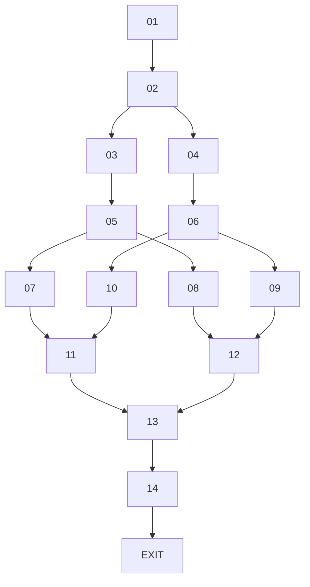

# 14-02 Topology Graph



## Exact convergence structure

```text
07 → 11 ← 10
08 → 12 ← 09

11 → 13 ← 12

13 → 14
14 → EXIT
```

The topology begins with a shared setup, splits into two primary approaches at Node 02, then braids equivalent consequence states across those approaches before global reconvergence.

- Nodes 03 and 04 develop the two primary approaches.
- Nodes 05 and 06 are branch-local two-outcome resolution points.
- Nodes 07/08 and 09/10 make those outcomes perceptible.
- Nodes 07 and 10 reconverge at Node 11.
- Nodes 08 and 09 reconverge at Node 12.
- **Node 11 → Node 13.**
- **Node 12 → Node 13.**
- Node 13 is the first global reconvergence.
- Node 14 provides shared development/handoff before exit.
- Every complete continuing route contains eight entries.

The exact authoritative connections and play-experience constraints are defined in `14-02-topology-plan.md`.
