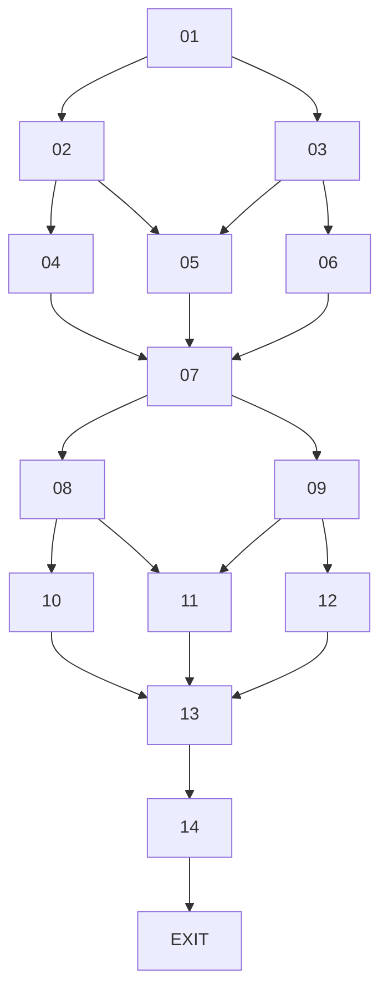

# 14-03 Topology Graph



## Exact structure

```text
FIRST PHASE

01 → 02 / 03

02 → 04 / 05
03 → 05 / 06

04 → 07
05 → 07
06 → 07


SECOND PHASE

07 → 08 / 09

08 → 10 / 11
09 → 11 / 12

10 → 13
11 → 13
12 → 13

13 → 14
14 → EXIT
```

## Topology identity

`14-03` is the **double-diamond / midpoint-reset topology**.

- Node 01 begins the first meaningful approach split.
- Nodes 02 and 03 resolve the first-phase approaches.
- Nodes 04, 05, and 06 pay off those outcomes.
- Node 07 is a genuine shared midpoint and establishes new common progression.
- Node 07 then launches a second independent split.
- Nodes 08 and 09 resolve the second-phase approaches.
- Nodes 10, 11, and 12 pay off those outcomes.
- Node 13 is the final global reconvergence.
- Node 14 provides shared development/handoff before exit.
- Every complete continuing route contains eight entries.

The exact authoritative connections and play-experience constraints are defined in `14-03-topology-plan.md`.
